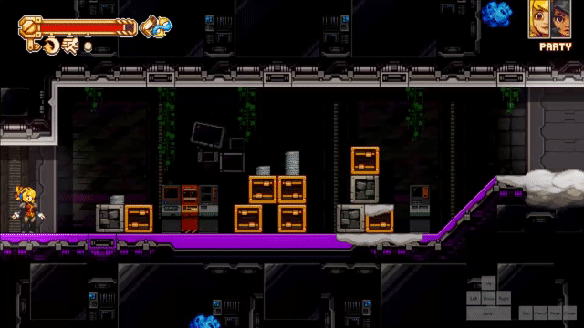
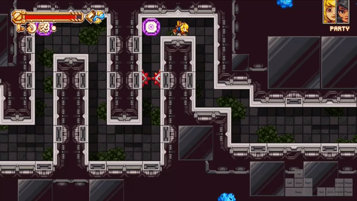
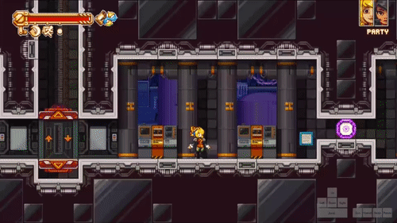

# Dodger 
Dodger is by far the best tweak in the game, and Any% NAS would probably be double the length without it.

## Roll Cancels
A way to optimize Dodger use, keeping the fast parts while minimizing the slower parts (i.e. the landing animation).

Dodger can be cancelled off edges, water, ladders, and cutscenes.

A cutscene cancel

An edge cancel

A ladder cancel

When Dodger is cancelled into water, you are given a crouched hitbox. This is useful for cutting corners for general movement in No Airswim → https://youtu.be/VKSlc5QBHQg?t=1131 
and for getting out of bounds in Airswim → https://youtu.be/a9OuEPKm-mw?t=1379 

**Note:** you are only given a crouched hitbox with a grounded roll or roll immediately after dropping through a platform. However, you can Pete tech while airborne to retain a crouched hitbox.

## Types of rolls
* Jump roll
  * Rolling right after jumping, gives a large arcing roll
  

* Falling roll
  * Rolling with some downwards momentum 

* Crouched roll
  * Rolling from the ground by holding controller crouch and pressing `Jump` + `Wrench` on the same frame to preserve a crouched hitbox; lets you squeeze through one tile wide spaces.

## Pete Tech

Allows for the preservation of a crouched hitbox without the need to use controller crouch, and saves having to set up virtual controller if you are very lazy and play on keyboard (like Pete).

Aerial Pete tech is very simple and actually quite applicable. Instead of performing a normal falling roll, press `Jump` + `Wrench` on the same frame to do the roll and you will have a crouched hitbox. This keeps some of your previous momentum which allows for some niche roll cancels.

Grounded Pete tech is used where there isn’t space to fall into a one tile wide space. Using a buffered `Jump` in the crouched roll makes it much easier to keep a crouched hitbox than the regular keyboard way, which requires frame perfect inputs: https://youtu.be/lsE6ZqRwaI4 

**Note:** never use grounded Pete tech, just install virtual controller if you’re on keyboard. It’s much better and you can use controller crouch for easy interactions in Airswim as well.
