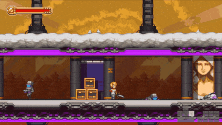
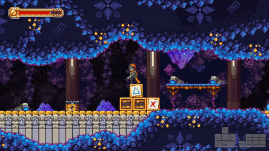

# Elro and Mina

In some sections of the game you are unfortunately forced to play as Elro or Mina. These two don't have very interesting mechanics, but there are a couple cool tricks.

## Elro damage boosting

Elro normally moves ridiculously slowly. This can be mitigated by damage boosting to store your speed when you take knockback from a hit. You do this by turning opposite to whatever direction you want to go, and holding where you want to go when you get hit. This provides persistent speed similar to how a BB works, and saves a lot of time in the walk up to the Lawrence fight.

This can also be used to gain speed from trading hits. Elro's `Gun` sword swing has a very small rear hitbox, and can cause trades when parrying projectiles. This is useful in the One Concern East section where you must parry a bomb from a sentry in order to progress. You can [kill the sentry while damage boosting](https://www.youtube.com/watch?v=fiRLsn9ZjcU) for the short walk up to the long hallway.

## Extending Mina’s dashes

Mina can dash if you press `Down` and `Jump` on the ground. This is her fastest movement on flat ground, and the dash length can be extended if you do them off ledges, preserving the higher speed for longer.

