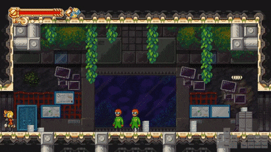

# Gun Tech

While your gun can shoot things, most of the time it'll shoot at nothing to invoke Newton's Third LawTM.

## Gunboosts

Shoot a charged shot downwards while airborne to gain height from the recoil; acts as a pseudo doublejump.

## Backboosts
Shoot a charged shot in one lateral direction then quickly hold in the opposite direction to gain a persistent speed boost. Extremely common way to increase movement speed, typically performed while airborne since grounded deceleration is more potent.

## Crawlspace Backboosts
Essentially a grounded backboost, but harder to pull off due to the increased deceleration from being on the ground the entire time.

Achieves the same speed a normal BB would.

## Upboosts
Shoot a charged shot upwards to quickly accelerate downwards. Can be cancelled by pressing `Wrench` much like stomp, and if `Wrench` is pressed right after shot release, there is no wrench animation.

Generally useless since there are far better uses for a charge shot, but has uses in places like Isilugar Depths for quickly accelerating into water, and for immediately going down to the bolt in every fast travel station (since we want to `Wrench` cancel to grab the bolt).

## Acrid Shots
Release a charged shot in one direction and on the very next frame press a new direction.

Will shoot the charged shot in the initial direction, and incur recoil from the second direction.

Viable and used in really only one place RTA, namely breaking the rocks before Controller without losing your prior slope boost, saving ~1.25s.

