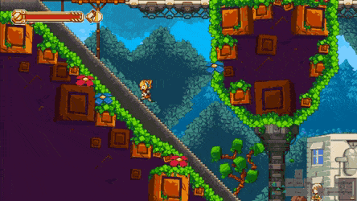
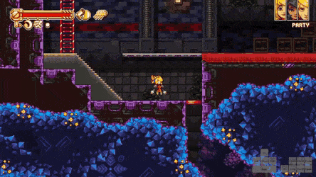
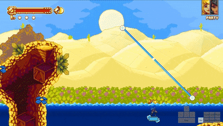
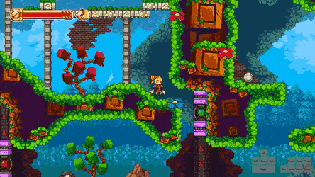
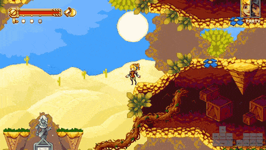

# Movement

## Slope Boosts
Stomp on a slope of at least ~45°, then `Jump` off of it while in the sliding animation to gain a lot of speed.

## Slope Runs
Essentially a slope boost that retains the high speed with no unnecessary height gain. Slope runs are useful in very few locations, mainly in spots where you want to be grounded a short distance after the slope, or you want no extra height because there is a low ceiling or something else obstructing your path. 

To perform a slope run, simply stomp on a slope like with an SB, but tap jump for only a couple frames (done so fast in the clip that the input display doesn’t detect it).

## Kill Boosts
Pressing `Jump` during the freezeframes that occur when an enemy dies, giving you a full midair jump and compatibility with gunboosts, unlike the Featherweight tweak.
You can also chain multiple killboosts to keep gaining height as long as you have enemies around to keep killing.

## Fast Crawls
Pressing `Jump` on the same frame you enter a crawlspace to preserve your normal ground speed as you travel through that space. The `Jump` input is almost always buffered while falling into the entrance to the crawlspace, rendering them trivial.

## Ladders
Simply holding `Wrench` and `Up` is always the fastest option to climb upwards; remember to `Jump` at the end of every ladder to skip the slow climbing animation. Here is a comparison between some alternative options: https://www.youtube.com/watch?v=mUNw_fV2pbk

Getting down ladders is more complicated, you want to be holding `Down` before you get on top of a ladder, then press `Jump` to drop through just like a platform.

The best way to do this is to `Jump` beforehand so that you land on top of the ladder, and start holding `Down` in midair before you reach it.

If you do happen to get the slow normal grab, quickly tapping `Jump` and falling down is faster than sliding down the ladder.

Note: you cannot grab the same ladder twice from one `Up` input, useful for avoiding the Shockwoods softlock leaving the fast travel. The input press is used to grab the ladder, and the input being held is used to direct the charge shot.

## Ninja Climbs
A faster way of getting off ledges than the traditional method of holding `Up` to climb; generally too risky to be used consistently unless there is some ulterior motive.

Executed by jumping away from a ledge, pressing `Gun` (giving early control), and moving back towards the ledge.

Note how it still works even while Gun is on cooldown.

## Crouch Cancelling
Taking a hit normally sends you backwards and leaves you unable to act for a long time. However, crouching while taking a hit gives you almost no knockback, leaving you in pretty much the same spot, and you can act much sooner than usual.

This is an important mechanic for multiple bosses, including

Bird: https://gfycat.com/frighteningquarrelsomehummingbird

The advanced Wrench Helicopter fight: https://gfycat.com/knobbycelebratedhatchetfish

As well as for general movement:

## Dismounting Bolts
For grounded bolts, there are two fast options to leave them:
 
* Jumping 
  * Typically when you want to BB right after wrenching the bolt
  

* Pressing Left or Right
  * When you just want to move quickly after wrenching
  

For ungrounded bolts, there are multiple options depending on what you want to do:
* Holding `Left`/`Right` and then `Jump`
  * Gives a lot of height with a floaty jump
* Tapping `Jump`
  * Makes you do a tiny hop in place, possibly useful for setting up a BB
* Holding `Down` and tapping `Jump`
  * Instantly leaving the bolt and falling down, the fastest option for just getting to the ground from where you are

## Fast Room Reloads
Reloading a room is noticeably faster when you crawl out and back in, minimizing the time spent in the actual rooms and going back into a transition much sooner than usual.

This is useful in two spots for Any% No Airswim, to reload the Robots 2 room after Fish Jump 2, and to reload the room in Tower where you reclaim Wrench.

Note how there is comparatively more time spent in black space and therefore less time spent in the actual room with fast reloads:

## Jumping Over Slopes
You lose precious milliseconds if you walk up a slope as opposed to jumping over it, because slopes slow you down more depending on how steep they are. As a general rule, jump over every slope in the game that you can, no matter how steep it is.

## Stomp Tech
Pressing `Jump` in the air while holding `Down` will make you stomp. Its intended use is to break through red stomp blocks scattered throughout the game.

Stomps are actually primarily used to slope boost, and they can be cancelled at any time by pressing `Wrench`

This will not work if Robin is in her landing animation, but is easily doable at any time before that, even right after hitting the ground. Cancelling a stomp immediately will not play the `Wrench` animation.

Another way to cancel stomp is by jumping right before you hit the surface of any pool of water. This will give you a full height jump, useful in Low% and 100% for the zip shown here.

Other instances of stomp cancels occur in very specific scenarios. If you stomp right after coming out of a crawlspace and try to cancel it with Wrench, the animation won’t actually play and you can move immediately after doing so. 

A similar thing happens if you stomp on the very last few pixels before falling off an edge, although these cases are completely useless. The stomp out of a crawlspace is helpful in only one spot, when coming out of the Floor 4 tunnel in Tower after grabbing the key. 

