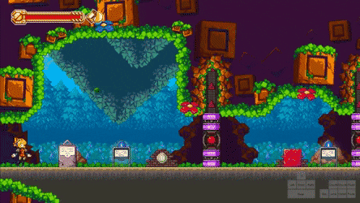
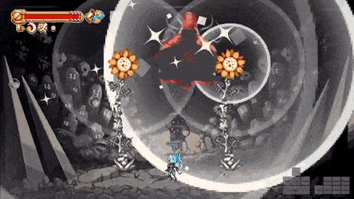
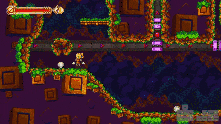
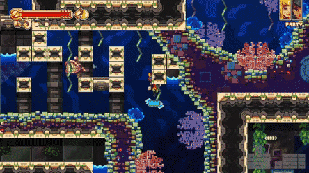
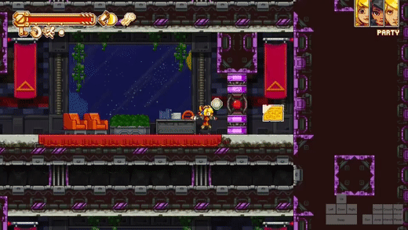

# Tricks 

## Fast charge shots
With all gun types, you can manipulate how the charging works by pressing and holding `Gun` when the cooldown bar shows only a few pixels of red.

This allows for much faster charged shot releases by playing the animation of Robin pulling out her gun during downtime, skipping a full red flash that normally happens when you charge.

## Fast bolt grabbing
When you `Wrench` on the ground, Robin makes a wide arcing motion starting from behind her to where she may eventually grab a bolt.

Wrenching from the air is a much faster option than the slow grounded wrench in almost all scenarios, some exceptions being locked bolts, and the bolt after you first meet Mina.

This means that for most grounded bolts in the game it’s better to wrench them from the air by falling into them.

## Fast text
The fastest method of skipping through text in the game, executed by pressing and holding `Jump` and then `Wrench` in quick succession.

You’ll notice that it runs through the textboxes abnormally quickly, and trumps even the best mashing if done correctly, especially over longer dialogues.

## Infinite wrench glitch
Used for Kerthunk skip and in the Nightmares segment before the Starworm fight to quickly charge electric wrench for Mina, and to quickly spin the gears for Royal.

Fairly simple to execute, just time the `Wrench` press soon after the background disappears and hold it until at full charge at least.

Note: IWG is rather finicky, so refrain from doing random inputs while you have it; `Wrench`, `Gun`, and pressing `Down` may mess it up, only use `Left`, `Right`, and `Jump` to be safe.

## Super bombs
Performed by charging bomb but releasing it right before it would charge enough to turn the shot into a rocket, shooting a bomb with much more momentum than usual. A decent cue to use for this is the first red flash to time your `Gun` release.                                           

Using a superbomb to make Robots 1 more consistent:

                                 

## Pause buffering
If you hold any inputs on the pause menu and then unpause, the game will register those inputs on the first frame after unpausing, allowing you to make tight tricks easier.

Useful for Ween skip, letting you get the ledge jump off easily:

You can also pause and unpause to search for correct frames for something like White skip, which then also abuses the input buffering mechanic.

## Zips
When an object is forced into a ceiling or wall by any means (this includes Robin, boxes, bombs, enemies), it moves very quickly up through the solid block until it reaches empty space large enough for it to leave the block.

There are many, many ways for zips to occur, most notably by stomping in tight spaces with Robin, crushing bombs or boxes with electric puzzle doors, and swapping with enemies in certain locations.

Here is an example that abuses the crouched hitbox of dodging into water to push Robin into a ceiling, and then stomping between a ceiling and a box (2 zips):

## Quantum leaps
The game stores a grounded position for Robin and updates this by checking if you’re on the ground exactly every 30 frames (0.5s) and changing it if you are.

This grounded position is stored even when you leave a room or area, so when you quantum leap the game takes your last (x, y) coordinate in the room you were in and places you that many units over, relative to the room that the area transition places you into.

Using the Strait → Shard leap as an example here:

The long Glass Strait room allows for a very large x coordinate and also gives a proper y value. When we QL, we store those room coordinates and carry them over to exactly where we need to be; the ladder before the Shard Wastelands fast travel.

QLs are performed by holding `Gun`, dodging into an area transition (any transition that causes that long white screen) from the air, and when you hit the load you must be holding the direction that you dodged at.

The screen will flicker a few times, and you will end up at the ladder if done correctly.

## Koatal air wrench
Lets you wrench ungrounded bolts that you would normally have to place a box under to to do, skipping certain puzzles and actually saving over a minute in the 100% category.

How it works is when Robin grabs a bolt while ungrounded she releases it just a few frames after doing so. This means there is a very tight window where you can `Wrench` and have it go through as if you had wrenched the bolt normally.

The trick is frame perfect, or at least very close to that. There are no known consistent setups to perform it, so your best bet is to `Jump` and mash `Wrench` or `Down` (which also turns bolts).

## Crafting from save statues
The normal crafting stations are very inconveniently placed in the base game for us to use them in any runs. Luckily, we can just craft from any save statue and completely ignore all the regular stations.

To craft from a save statue, go to the `EQUIP TWEAKS` screen after interacting with one. Once there, hold `Gun` and press `Swap`. It should take you to a series of instructions about how to craft tweaks. Skip this screen, and you’ll end up in the regular tweak crafting menu, and can make whatever you want from there.

